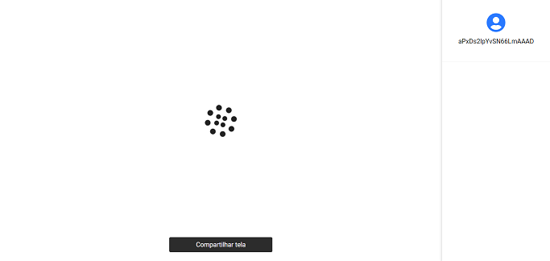
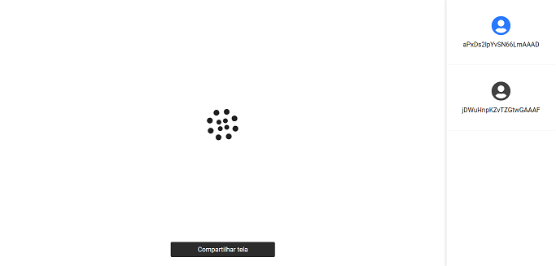
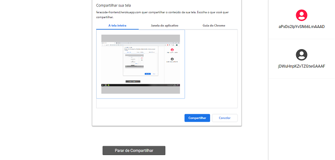
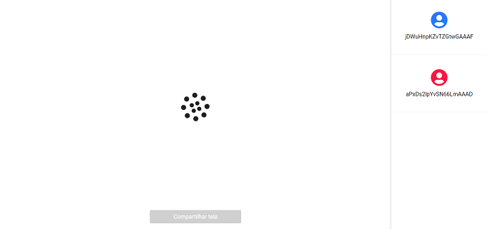
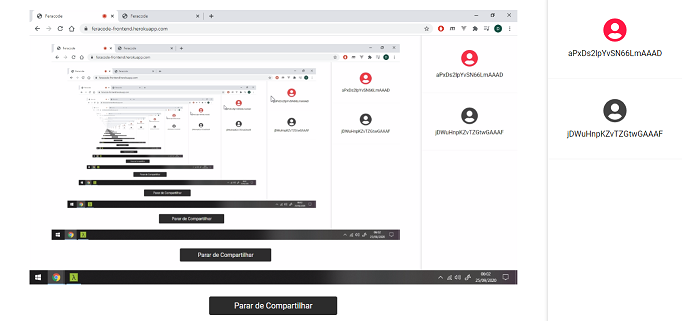
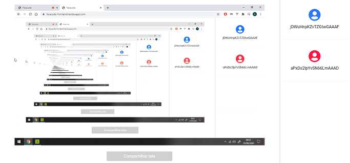

# Feracode Front-end

Simple application using WebRTC technology to screen share. This current version supports up to four people in the room, where one is the streamer and the rest are the viewers. Just one person can stream at a time and if someone else want to stream they have to await the streamer end the transmission and then it is made available again.

## ☁️ Links

- [Live preview](https://feracode-frontend.herokuapp.com)
- [Back-end code](https://github.com/douglasJovenil/feracode_backend)

## 💻 Project

#### User alone in the room

<p align="center">
   
</p>

#### Two users in the room

<p align="center">
   
</p>

#### User starting a stream

<p align="center">
   
</p>

#### Viewer screen while streamer select a streaming source

<p align="center">
   
</p>

#### Streamer screen during the stream

<p align="center">
   
</p>

#### Viewer screen during the stream

<p align="center">
   
</p>

## 🚀 Technologies

This project was developed with the following technologies:

 Typescript

 ReactJS

 Styled-Components

 WebRTC

 SocketIO

## 🏃 Usage

```bash
git clone https://github.com/douglasJovenil/feracode_frontend
cd feracode_frontend
yarn install
yarn start
```

## 📔 TODO
- Fix bug that occurs when a user try to join the room and the streamer finishes the stream
- Develop environment variables to use at Heroku
- Configure CORS
